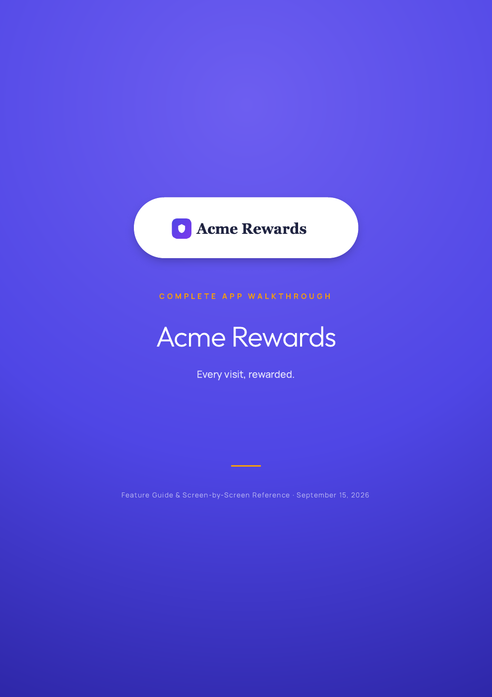
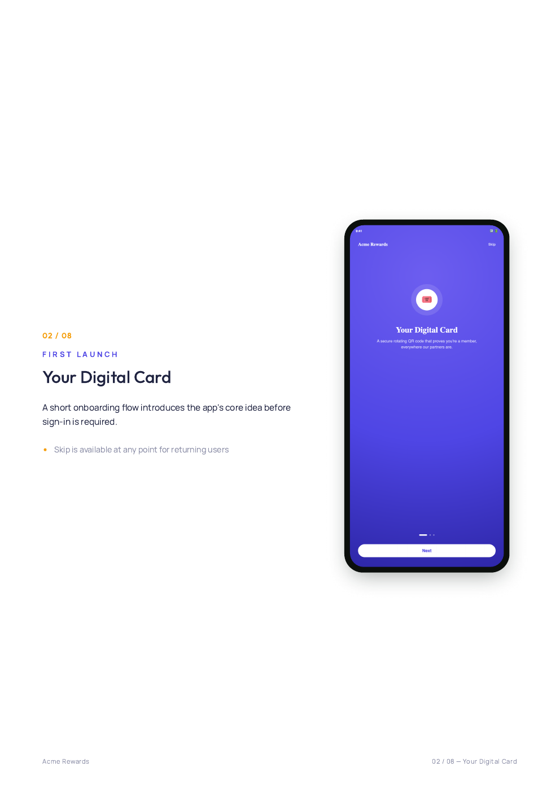
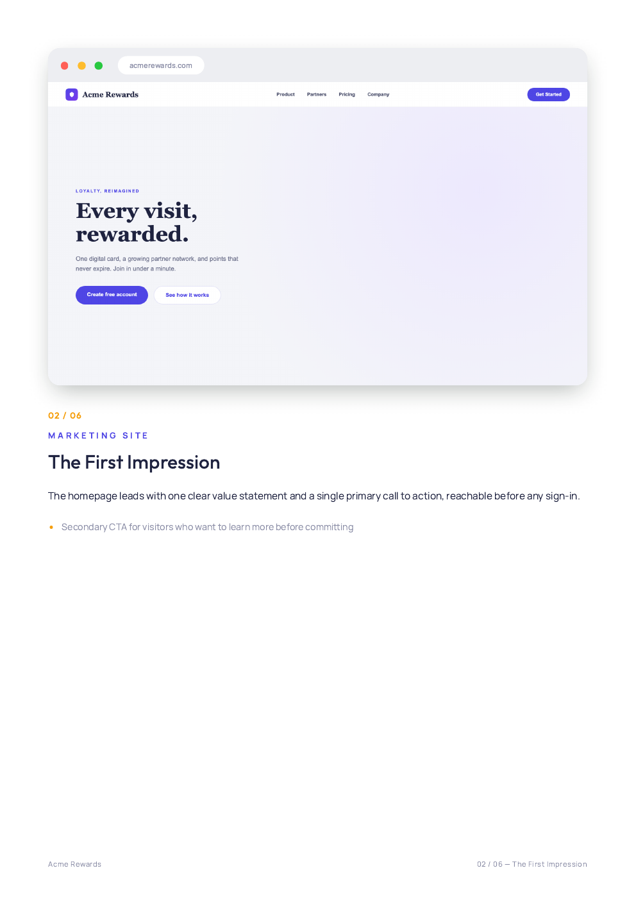

# app-walkthrough

A [Claude Code](https://claude.com/claude-code) skill that turns a mobile
app, website, or web app into a **narrated walkthrough video** and a
**matching styled PDF guide** — by actually capturing real screens from a
running emulator/simulator/browser, writing narration, synthesizing local
text-to-speech, and rendering both deliverables end to end.

No cloud TTS bill, no manual screen recording, no slide deck. Point it at an
app and it does the whole pipeline: capture → script → voiceover → video →
PDF. Mobile apps get a vertical video with a phone-bezel mockup; websites
and web apps get a landscape video with a browser-chrome mockup — same
pipeline, one `"platform"` field in the script picks the layout.

## What you get

A short narrated MP4 (mockup of the real screens, brand-colored title
cards, synced voiceover) and a styled multi-page PDF (cover, table of
contents, one page per screen with a write-up, closing page) — both built
from one shared `script.json` so they never drift out of sync with each
other. Both examples below are the same fictional demo brand ("Acme
Rewards" — synthetic mockup screens, not a real product), run twice: once
as a mobile app, once as a website/web app, so you can see exactly what
each platform's output looks like before running it on your own app.

### Mobile app example

<p align="center">
  
  
</p>

<p align="center">
  <video src="example/video/out/walkthrough.mp4" controls width="320"></video>
  <br/><sub>Vertical video, phone-bezel mockup, ~85s (click to play)</sub>
</p>

**[`example/`](example/)**:
- [`example/video/out/walkthrough.mp4`](example/video/out/walkthrough.mp4) — the rendered video (~85s)
- [`example/docs/walkthrough.pdf`](example/docs/walkthrough.pdf) — the rendered PDF (11 pages)
- [`example/script.json`](example/script.json) — the source script driving both

### Website / web app example

<p align="center">
  
  
</p>

<p align="center">
  <video src="example-web/video/out/walkthrough.mp4" controls width="480"></video>
  <br/><sub>Landscape video, browser-chrome mockup, ~65s (click to play)</sub>
</p>

**[`example-web/`](example-web/)** — same brand, `"platform": "web"` in
`script.json`, everything else identical:
- [`example-web/video/out/walkthrough.mp4`](example-web/video/out/walkthrough.mp4) — the rendered video (~65s)
- [`example-web/docs/walkthrough.pdf`](example-web/docs/walkthrough.pdf) — the rendered PDF (9 pages)
- [`example-web/script.json`](example-web/script.json) — the source script driving both

## Install

```bash
git clone https://github.com/surenjanath/app-walkthrough-skill.git ~/.claude/skills/app-walkthrough
```

That's it — Claude Code picks up skills from `~/.claude/skills/<name>/SKILL.md`
automatically. (For a single project instead of every project, clone into
`<project>/.claude/skills/app-walkthrough` instead.)

## Use it

Just ask, in Claude Code, inside the app's project:

> "Can you make a walkthrough video and PDF for this app?"

Claude will read `SKILL.md`, ask you a few quick questions where it
genuinely needs input (how to capture screens, whether the app needs test
credentials, narration approach), then run the full pipeline. You can also
invoke it explicitly with `/app-walkthrough`.

## Requirements

The skill checks for these itself and will tell you what's missing, but for
reference:
- **Screen capture:** Android SDK platform-tools (`adb`) + an emulator AVD,
  or Xcode Simulator, or a browser (for a web app)
- **Local TTS:** [`uv`](https://github.com/astral-sh/uv) (for a throwaway
  Python venv), [`espeak-ng`](https://github.com/espeak-ng/espeak-ng)
  (`brew install espeak-ng`) — [Kokoro](https://github.com/hexgrad/kokoro)
  itself installs into the venv, no API key
- **Video:** Node.js, [Remotion](https://www.remotion.dev/) (installed via
  npm into the generated project, not this repo)
- **PDF:** Google Chrome (used headless for `--print-to-pdf`)
- `ffmpeg` for audio format conversion

## What's inside this repo

```
SKILL.md          the playbook Claude follows — read this to see the whole process
reference.md      hard-won gotchas from building this (adb coordinate math, a React
                   Native Modal touch-bounds bug, Remotion interpolate() pitfalls,
                   Chrome print-to-pdf pagination, Kokoro setup, and more)
assets/
  script.example.json       the script.json shape for a mobile app
  script.web.example.json   the script.json shape for a website / web app
  audio/                    Kokoro narration generator
  docs/                     the PDF HTML generator (headless-Chrome print-to-pdf;
                             phone-frame or browser-chrome layout, by platform)
  video-template/           a ready-to-copy Remotion project (phone-frame mockup for
                             mobile, browser-chrome mockup for web, brand-badge logo,
                             synced voiceover, no motion by default)
example/           full pipeline run, mobile platform, against a synthetic demo app
example-web/       full pipeline run, web platform, same synthetic demo app
```

## Why this exists

Built by actually doing this once, live, for a real app — hitting (and
writing down) every gotcha along the way rather than guessing at a generic
process. `reference.md` is the part worth reading even if you never run
Claude Code — it's a real account of what breaks when you drive a React
Native app via `adb`, why `interpolate()` throws in Remotion, and why a
naive HTML→PDF pagination silently corrupts page layout.

## License

MIT — see [LICENSE](LICENSE). Use it, fork it, improve it, send a PR.
